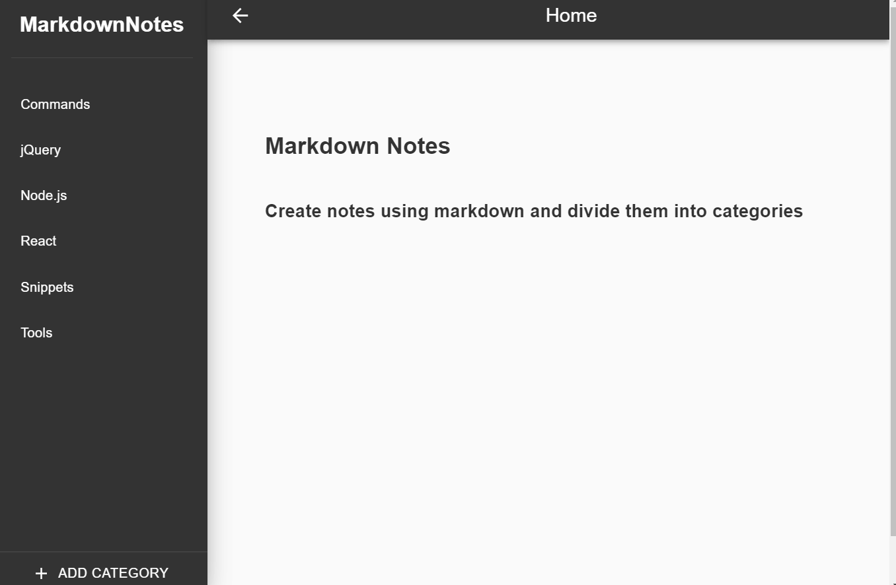
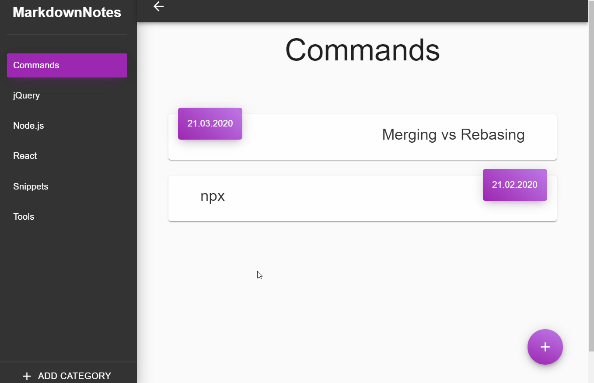
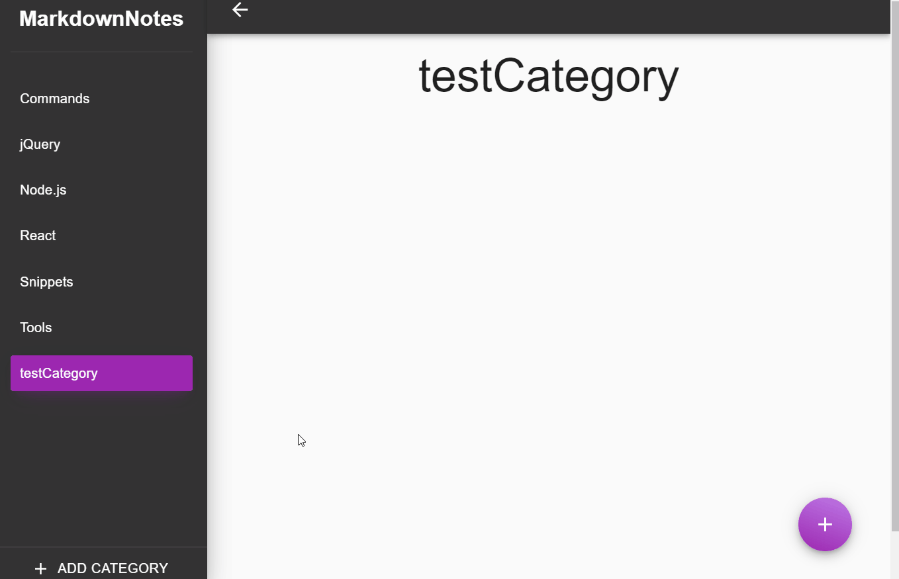
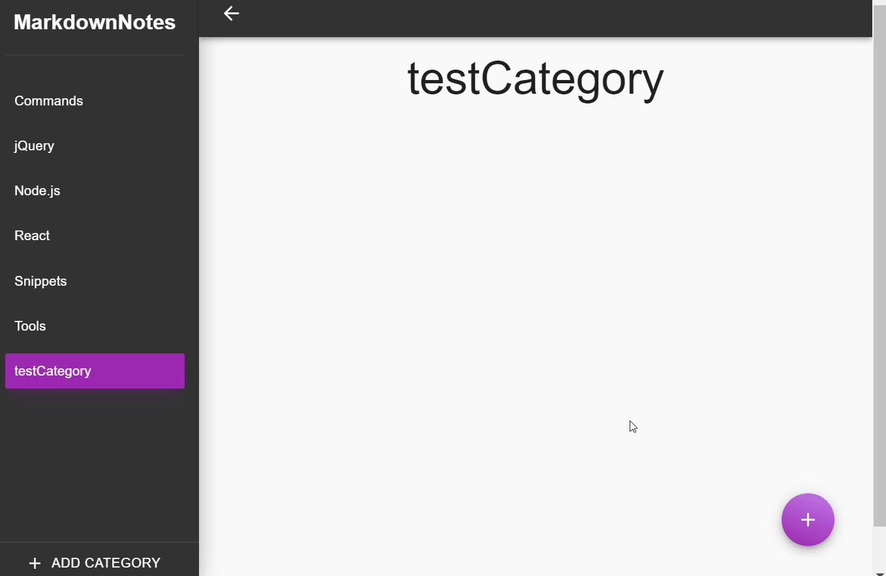

# MarkdownNotes

- Desktop application for creating notes using markdown.

## Technologies used:

- React
- Electron
- Material-ui
- Redux
- ImmutableJS

## Features:

- Categories view

- Add Category

- Delete Category

- Add Post

